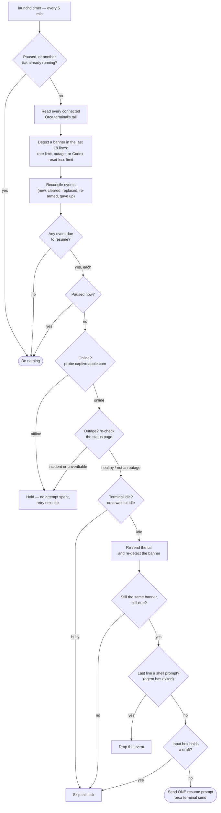

<p align="center">
  
</p>

# Orca Watchdog

**Orca Watchdog** is a local [launchd](https://www.launchd.info/) daemon for
macOS that watches your connected [Orca](https://onorca.dev) terminals for a
stalled agent TUI and sends a one-line resume prompt when — and only when — it
is safe to. Zero AI, zero tokens: it acts precisely when the agent subscriptions
it watches are exhausted or a provider is down, and does nothing the rest of the
time. (The installed command is `orca-watchdog`.)

It handles three conditions:

- **Rate limit** — a terminal shows a limit banner with a stated reset time. The
  watchdog waits until that time has passed and the terminal is still idle on the
  banner, then sends one resume prompt.
- **API outage** — a terminal shows an outage banner (Claude Code's own
  `API Error: 5xx / Connection error / overloaded_error`, or Codex's error line).
  The watchdog waits out a hold, re-checks the provider's status feed
  (`status.claude.com` / `status.openai.com`), and resumes once the incident
  clears.
- **Codex limit with no reset time** — asks you what to do in a native macOS
  alert; nothing is sent until you choose **Continue** or **Wait 1h**.

It watches **Claude Code**, **Codex**, and **Gemini CLI** terminals (see
[Supported agents](#supported-agents)). It is plain Node with no dependencies,
and its only network access is a lightweight connectivity probe (before any
resume) and the provider status feeds (contacted only when an outage resume is
actually due).

> [!IMPORTANT]
> The watchdog's entire blast radius is `orca terminal send` into your live
> agent terminals. Every design choice errs toward **not** sending: it installs
> stopped, holds instead of guessing whenever a check is inconclusive, and never
> touches a terminal that is busy, holds a draft, or has dropped to a shell
> prompt.

## Requirements

- **macOS** (uses `launchd` and `plutil`).
- **Node.js 22 or newer.** Homebrew installs this for you; the archive install
  expects `node` on your `PATH` (or set `ORCA_WATCHDOG_NODE` to an absolute path).
- **[Orca](https://onorca.dev)** with its `orca` CLI available (or set `ORCA_CLI`
  to its absolute path). The watchdog needs `orca terminal list/read/wait/send`.

## Install

The watchdog installs **stopped** — it does nothing until you start it. Nothing
is registered with `launchd` and no terminal is ever touched until then.
Installing is only step one; **[First run](#first-run) is what turns it on.**

### Homebrew (recommended)

Add the tap, trust it (newer Homebrew requires trusting third-party taps), then
install:

```bash
brew tap johncioni/tap
brew trust johncioni/tap
brew install johncioni/tap/orca-watchdog
```

Homebrew installs Node for you and manages upgrades (see [Update](#update)). It
also installs the shell completions and the `man orca-watchdog` page.

### Archive

Download the release archive and its checksum from the
[releases page](https://github.com/johncioni/orca-watchdog/releases), verify it,
then run the bundled installer (substitute the version you downloaded for
`<version>`):

```bash
# from the download directory, with the .tar.gz and .sha256 side by side:
shasum -a 256 -c orca-watchdog-<version>.tar.gz.sha256   # verify the download
tar xzf orca-watchdog-<version>.tar.gz
cd orca-watchdog-<version>
./install.sh
```

The archive installs a versioned copy under
`~/.local/share/orca-watchdog/<version>/` and links the command into
`~/.local/bin/orca-watchdog` (make sure `~/.local/bin` is on your `PATH`).

The archive also ships shell completions and a man page under `completions/` and
`man/`, but `install.sh` does not wire them into your shell — set them up by hand
if you want them (Homebrew does this for you). From the extracted directory:

```bash
# Bash (with bash-completion): source it, or copy into a completions dir
source completions/orca-watchdog.bash
# Zsh: place _orca-watchdog on your $fpath, e.g.
cp completions/_orca-watchdog ~/.zsh/completions/   # then: fpath+=~/.zsh/completions; autoload -Uz compinit; compinit
# Fish
cp completions/orca-watchdog.fish ~/.config/fish/completions/
# Man page: copy into a directory on your $MANPATH, e.g.
cp man/orca-watchdog.1 ~/.local/share/man/man1/       # then: man orca-watchdog
```

## First run

```bash
orca-watchdog doctor   # confirm macOS, Node, Orca, and launchd state
orca-watchdog start    # validate, then register the LaunchAgent
orca-watchdog status   # service health, pause state, active events
```

Once started, `launchd` runs the watchdog every 5 minutes.

## Operate

```bash
orca-watchdog status     # service / pause / events, reported separately
orca-watchdog logs       # latest activity (read-only); --follow, --lines, --source
orca-watchdog pause      # stop acting without unregistering or losing state
orca-watchdog resume     # re-enable
orca-watchdog --dry-run  # run one observation-only tick; never sends input
orca-watchdog stop       # unregister the LaunchAgent (state is retained)
```

These are two independent layers. **`start` / `stop`** load or unload the
LaunchAgent — whether the service is registered with `launchd` at all.
**`pause` / `resume`** toggle whether an already-loaded service *acts*, without
unregistering or losing state. They don't substitute for each other: `resume`
won't start a stopped service, and `start` won't un-pause a paused one.

`pause` takes effect immediately — it also halts the remaining sends of a tick
that is already running, not just future ticks.

Logs and state live under `~/.local/state/orca-watchdog/`: `watchdog.log`
(activity), `launchd.out.log` / `launchd.err.log` (service output), `state.json`
(tracked events), and `disabled` (present while paused). State and log files are
created owner-only (`0600`).

## Update

**Homebrew:**

```bash
orca-watchdog stop
brew upgrade johncioni/tap/orca-watchdog
orca-watchdog doctor && orca-watchdog start
```

**Archive:** stop, install the new archive (it keeps the previous version for
rollback), then start again:

```bash
orca-watchdog stop
cd orca-watchdog-<new-version> && ./install.sh
orca-watchdog doctor && orca-watchdog start
```

If a new version misbehaves, roll back to the previous one and start:

```bash
orca-watchdog stop
./install.sh --rollback
orca-watchdog start
```

Your pause state and tracked events are preserved across updates. Downgrading to
a version from before the reset-less alert feature, or from before Gemini
support, causes that version to back up and reset a state file that contains the
newer event kind or platform.

## Remove

```bash
orca-watchdog stop
brew uninstall johncioni/tap/orca-watchdog   # Homebrew
./uninstall.sh                               # archive
```

Removal unregisters the service and deletes the installed copy but **retains your
state** at `~/.local/state/orca-watchdog/`. Delete that directory by hand if you
want a clean slate.

## Troubleshooting

- **`orca-watchdog doctor`** is the first stop: it reports macOS, Node, Orca CLI,
  launchd registration, pause, and event state, and exits non-zero if anything
  required is missing.
- **`orca` not found under launchd?** launchd runs with a minimal `PATH`. The
  watchdog resolves absolute paths to Node and Orca when you `start`, so start it
  from a shell where `orca` resolves, or set `ORCA_CLI` to an absolute path.
- **Nothing happens on a stalled terminal?** Run `orca-watchdog --dry-run` to see
  what the current tick observes, and read the activity log with
  `orca-watchdog logs`.
- **Inspecting logs.** `orca-watchdog logs` prints the latest activity (read-only);
  add `--follow` to watch it live, `--lines N` for more history, or
  `--source stdout|stderr` to see the launchd job's own output — the first place to
  look if the service is registered but ticks never run.

## How it works

`launchd` runs `watchdog.mjs` every 5 minutes. Each tick reads every connected
Orca terminal's tail, looks for a banner in the last 18 lines, reconciles what it
finds against the events it is already tracking, and then — for any event whose
resume is due — walks a fixed sequence of safety gates before it will send. If
any gate is inconclusive, it holds and tries again on a later tick.



The details behind the diagram:

- **Rate limit.** Parses the stated reset time; once it has passed and the
  terminal is still idle on the banner, sends one resume prompt. Relative
  forms (`in 2h 30m`, `in 3 days`) count from detection. A clock time is read
  as the machine's local time unless a zone abbreviation follows it (`PST`,
  `PDT`, `MST`, `MDT`, `CST`, `CDT`, `EST`, `EDT`, `UTC`, `GMT`, `Z`), which is
  taken at its fixed offset with no daylight-saving inference. An IANA zone in
  parentheses after the clock, such as `12:30am (America/New_York)`, uses that
  zone's daylight-saving rules. An invalid IANA zone falls back to local time.
  Normally one send per event, with up to two retries 30 minutes apart before it
  gives up loudly in the log. If the banner is still on screen but its reset time
  moves materially later, the watchdog honours the new time and keeps waiting.
- **API outage.** Waits 10 minutes, then before each send re-checks the provider's
  status feed. A `major`/`critical` Statuspage indicator (or an open Google Cloud
  incident naming the product) holds the send without consuming an attempt — and
  so does a feed that can't be reached or returns an unexpected response: the gate is **fail-closed**, so only a confirmed-healthy
  status lets the resume proceed (`hold: provider health unverifiable` is logged
  otherwise). Up to 6 sends 30 minutes apart, with a hard stop 24 hours after
  detection. Codex terminals are additionally held while `Reconnecting... N/5` or
  `esc to interrupt` is on screen.
- **Connectivity probe.** Before sending **any** resume, the watchdog confirms the
  machine is online with a single HTTPS reachability probe to
  `https://captive.apple.com/hotspot-detect.html`. While offline it holds without
  spending an attempt and retries once connectivity returns, so a resume is never
  fired into the void during a local network drop. The probe host is overridable
  via `WATCHDOG_CONNECTIVITY_URL` (loopback hosts only, for testing); anything
  else is ignored with a warning.
- **Codex reset-less limit.** For a Codex `■` limit banner with no derivable reset
  time, the watchdog shows one native macOS alert per episode. **Continue** enables
  retries starting on the next tick, spaced 30 minutes apart, capped at 6 sends and
  24 hours from your choice. **Wait 1h** delays the first retry by an hour, with the
  same 24-hour cap (offline time counts toward it). **Stop** suppresses retries
  until the banner is confirmed gone, even if its wording or reset time changes. No
  click means no send. Choices are stored per terminal and episode under
  `~/.local/state/orca-watchdog/choices/` and deleted after consumption. This alert
  is Codex-only, and `--dry-run` never opens it or consumes a choice.

A few invariants worth stating plainly: every kind **refuses to send when the
terminal's last line is a shell prompt** (the agent has exited) or when the input
box already holds a draft (including Gemini's `*`-glyph box). Outage detection is
scoped to Claude Code's `API Error` banner (accepted on Claude-identified and
unidentified terminals alike) and to Codex's error line on Codex-identified
terminals only; rate-limit detection is generic, with agent-specific idle chrome
recognised for Claude Code and Gemini CLI. Untrusted terminal text
is length-capped and sanitized (secrets redacted) before it is matched or logged,
and a malformed read or parse on one terminal can never abort the tick for the
others. Network access is limited to the connectivity probe (once per tick that
has a send due) and the provider status feeds (only when an outage send is due,
at most once per provider per tick).

## Supported agents

Every agent the watchdog understands is one entry in a small, frozen provider
registry inside `watchdog.mjs`. Orca tells the watchdog which agent a terminal
runs (`agentIdentity`), and the registry entry for that agent declares what may
be detected, how its idle input box looks, and where its status feed lives.
Anything not in the registry is `unknown`: rate-limit banners are still
detected generically, Claude Code's own `API Error` outage banner is still
recognised (it is unmistakable, and the terminal is then treated as Claude),
but Codex's `■` error line and all agent-specific chrome require Orca's
identity.

| Agent | Rate limit | API outage | Status feed | Notes |
|---|---|---|---|---|
| Claude Code | yes | yes | `status.claude.com` (Statuspage) | Orca identities `claude` and `claude-agent-teams`. Supports `You've hit your session limit · resets <time> (<IANA zone>)` and the existing Claude limit forms. |
| Codex | yes (+ reset-less alert) | yes (`■` error line) | `status.openai.com` (Statuspage) | Held while `Reconnecting… N/5` is on screen. |
| Gemini CLI | yes | no | Google Cloud `incidents.json`, product *Vertex Gemini API* | `Usage limit reached for <model>.` / `Access resets at <time>.` A zone abbreviation after the clock (`3:00 PM PST`) is honoured at its fixed offset; a bare clock is read as local time. Gemini's high-demand fallback line is transient and self-heals, so no outage rule. |

A registry entry carries: the Orca identities that map to it; which event kinds
it may raise (`limit`, `outage`, reset-less `limitOpen`); its limit rule
(generic, or Codex's `■` form); source-verified outage patterns; screen chrome
that may legitimately follow a banner while the agent is still stalled (so a
stale banner with real output after it is ignored); a draft pattern so the
watchdog never types into an input box that already holds text; and a status
adapter (`statuspage`, `gcp-incidents`, or `none`). Every feed-backed adapter is
fail-closed: a feed that cannot be fetched or parsed holds the resume rather than
allowing it. (Gemini's Google Cloud adapter is declared but not yet queried,
because Gemini raises no outage events.)

To exercise a provider without a live agent, use the fakes under `e2e/`:
`node e2e/fake-tui.mjs <file> "3am"` prints the classic Claude limit banner by
default. The `--session-limit` mode prints the captured Claude session-limit
banner and idle screen. `node e2e/fake-tui.mjs <file> --gemini "3:00 PM PST"`
prints Gemini's real banner and idle box. The `--outage`, `--outage-read`, and
`--outage-marker` modes cover Claude's supported outage envelopes.
`node e2e/status-stub.mjs <port> --gcp "Vertex Gemini API"
open,closed,none` serves Google Cloud-shaped incident feeds on loopback (the
bare form serves Statuspage indicators). Point the daemon at a stub with
`WATCHDOG_STATUS_URL_<PLATFORM>` (loopback URLs only). Adding an agent is a
registry entry plus fixtures from a real session; see `CLAUDE.md`.

## Contributing & security

- Contributor setup and workflow: [`CONTRIBUTING.md`](CONTRIBUTING.md).
- Reporting a vulnerability: [`SECURITY.md`](SECURITY.md).

## License

[MIT](LICENSE) © John Cioni. An independent community utility; not affiliated
with Orca, Anthropic, or OpenAI.
